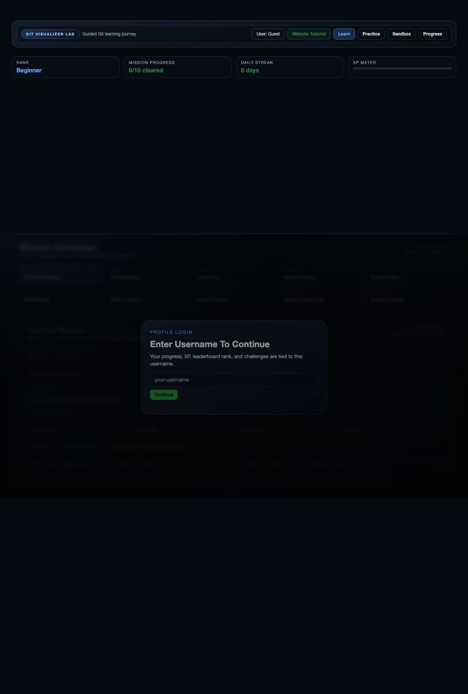

# GitVisualizer

Git is powerful, but for many developers it feels invisible and abstract.

**GitVisualizer** turns Git into a playable system.  
You type commands, the repository changes in real-time, and the commit graph explains what happened visually.

Live site: [https://sureshkonar.github.io/GitVisualizer/](https://sureshkonar.github.io/GitVisualizer/)

## Why This Exists

Most Git tutorials teach syntax first.  
This platform teaches **mental models first**:

- What changed in history?
- What moved in branches?
- What happened to HEAD, index, and working tree?
- Why does `merge` look different from `rebase`?

The goal is simple: help users go from "copy-paste commands" to "I understand what Git is doing."

## Visual Tour

### 1) Hero + Guided Flow


### 2) Mission-Led Learning


### 3) Live Sandbox + Graph


## Core Experience

### Learn
- Guided mission campaign from beginner to advanced Git
- Command explorer mapped to official docs
- Visual before/after command cards

### Practice
- LeetCode-style mission solving interface
- Objectives, hints, scoring, stars, and XP
- Real command execution in a simulated repo

### Sandbox
- Free terminal playground
- Live commit graph updates while you run commands
- Git Coach feedback loop after each command

### Progress
- Username-based progress tracking
- Local leaderboard and profile export/import
- GitHub repo sync for profile sharing

## Gamification Features

- XP progression and rank tiers
- Achievements (First Commit, Branch Creator, Merge Master, Rebase Ninja)
- Daily challenge + streak tracking
- Mission scoring by correctness, command count, hints used, and speed
- Shareable challenge links for friends

## Phase Implementation Status

- Phase 1: Username profiles + resume + local leaderboard
- Phase 2: GitHub repo-backed profile sync and remote leaderboard
- Phase 3: Friend challenge links + LinkedIn/GitHub sharing

## Tech Stack

- Next.js 14 (App Router)
- TypeScript
- TailwindCSS
- Framer Motion
- Custom Git simulation engine (client-side)

## GitHub Pages Deployment

Project is static-export compatible.

`next.config.js` includes:

- `output: 'export'`
- `basePath: '/GitVisualizer'`
- `assetPrefix: '/GitVisualizer/'`
- `images: { unoptimized: true }`

Workflow file:

- `.github/workflows/deploy.yml`

## Local Development

```bash
npm install
npm run dev
```

## Production Build

```bash
npm run build
```

Output is generated to `out/` for GitHub Pages deployment.
